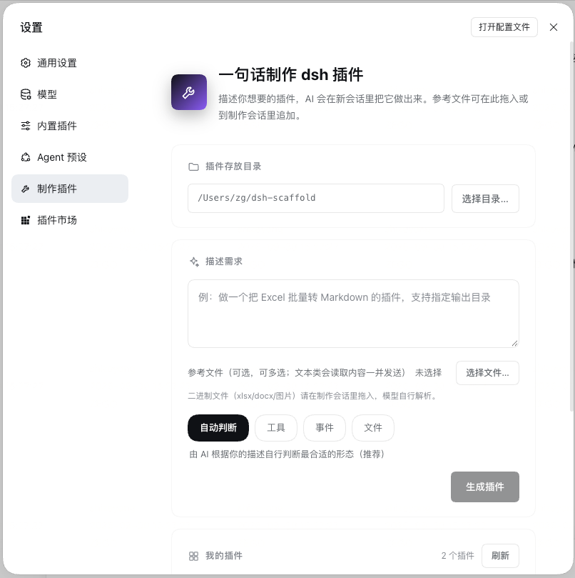

# dsh-plugin-generator — 会话能力固化 & 一句话制作插件

**把「一次成功的 dsh 会话」固化成可复现的插件；也可以一句话从零生成插件。**

**两个痛点：**
- 在 dsh 里和 AI 反复多轮对话 —— 生成代码、配脚本、处理文本、查询出结果，终于调通。
会话一关，下次做同类任务：重新复述需求、重新多轮沟通、重新调一遍提示词……
- dsh 插件开发门槛不低：要写 Cordis 插件（name / inject / apply(ctx)）、要懂 defineTool 注册、要配 cordis.patch.yml 打包成 bundle、要会用 dsh plugin --profile <名> add <包> 安装。社区已有 900+ 插件，但"从想法到能跑的插件"仍有较长路径。


**这个插件就是解决这些痛点的**

- **能力固化**：会话里做出满意的结果后，点一下按钮，本插件自动提取这次会话的 需求原文 + 工具过程 + 最终结果，生成一个"复现这次产出能力"的插件。以后在任意会话里描述同类需求，模型加载该插件里固化的 skill 按既定流程执行——产出水准稳定复现，不靠运气。
- **一句话生成**：描述「做一个把 Excel 批量转 Markdown 的插件」（可附参考文件），scaffold 会在新会话里驱动模型完成 计划确认 → 生成骨架 → 写业务代码 → 校验修复 → 打包安装 的完整流程。

两种模式共用同一套生成管线，生成插件的"智力"来自 dsh 会话自身的模型，本插件只提供"手和规矩"。

## 界面

**会话窗口里的固化入口**（assistant 回复操作条上的盒子图标）：


在任意 assistant 回复的 👍/👎 旁点盒子图标，即以**那条回复为止**的会话（需求原文 + 工具过程 + 该条结果）为素材，自动创建制作会话并跳过去完成固化。不点按钮、直接说「把这次会话的能力固化成插件」则固化整段会话。

固化生成的插件结构：

```
生成的插件/
├── assets/skill.md        # 步骤 / 规则 / 产出契约（静态文本，钉死"做什么"）
├── assets/examples.json   # 少样本示例（钉死"做到什么程度"）
└── src/
    ├── index.js           # 注册 skill + validate/render 工具
    └── harness.js         # 确定性校验与渲染（纯代码，无模型参与）
```

稳定性三层：skill 文本不变 → 示例给出水准锚点 → `xxx_validate` 机器校验候选产出（不过就按逐条错误自修复）→ `xxx_render` 确定性渲染最终结果。随机性被压缩到最小。

**设置页「制作插件」**（与 通用 / 模型 / 插件 并列的独立 section，一句话生成与插件管理的入口）：



- 填需求、选插件类型（自动判断 / 工具 / 事件 / 文件 / 能力套件）
- **参考文件多选**：文本类文件内容随需求一起发给制作会话（每个文件以 `===== 文件名 =====` 分段，选错可 ✕ 移除，约 6 万字符封顶）；二进制文件（Excel/Word/图片）请在会话里拖入
- 点「生成插件」自动创建制作会话并**定位、一键跳转**过去看生成过程
- 设置**插件存放目录**（默认 `~/dsh-scaffold`，长期生效）
- 页面下半部分实时罗列自制插件及运行时状态（未安装 / 已启用 / 已禁用 / 未激活），支持安装（预检）/ 启用 / 禁用 / 卸载 / 更新 / 导出 zip / 复制安装命令（多 profile），全部 live 生效

## 功能一览

| 功能 | 说明 |
| --- | --- |
| **能力固化**（核心） | 把「一次成功会话的做法」固化成插件：skill 钉死"做什么"、少样本示例钉死"做到什么程度"、确定性工具校验并渲染最终结果——以后稳定复现同样的产出水准 |
| **一句话生成插件** | 自然语言描述需求（可附参考文件），自动产出五种形态的插件：`tool`（给模型加可调用能力）、`events`（监听会话生命周期）、`file`（文件处理：Excel/Word/CSV 解析、产物落盘）、`capability`（即能力固化模板）、`toolkit`（把多个 MCP server + 编排 skill 打成一个能力套件） |
| **插件管理生命周期** | 设置页内直接 安装（预检：装依赖→import→apply）/ 启用 / 禁用 / 卸载 / 更新 / 导出 zip / 复制安装命令（多 profile），全部 live 生效 |

## 安装

```bash
dsh plugin --profile <profile> add <本仓库目录>
```

## 原理

本插件自身是一个 dsh bundle 插件，有 host 与 browser 两个半区：

- **host 半区**：注册内嵌技能 `make-dsh-plugin` 与 9 个 `scaffold_*` 工具（plan / create / write_file / read_reference / validate / package / install / **capture**——capture 直接读取 dsh 会话日志，把会话的 需求/过程/结果 提取为能力固化的素材 / **probe_mcp**——探测 MCP server 可达性）；web profile 里额外挂载「制作插件」页面（HTTP 路由 + webhook 规则）。
- **browser 半区**（`client.js`，dsh 客户端插件格式）：设置页的「制作插件」section（注册于 `settings.section` slot）+ 制作页面 + 每条 assistant 回复上的固化按钮（注册于 `conversation.chat.assistant-actions` slot）。

流程均为：出计划向你确认 → 生成骨架 → 写业务代码 → 校验（有错自修复）→ 打包 zip + 安装命令；说「装到 xx profile」可让模型直接完成安装。

## 目录结构

```
├── package.json          # bundle 声明（dsh.bundle.patch）+ 客户端声明（dsh.client）
├── cordis.patch.yml      # 挂载条目（插件本体 + dsh-webhook 运行时）
├── client.js             # 浏览器半区：设置页 section + 制作页面 + 会话固化按钮
├── src/
│   ├── index.js          # 插件入口（name / inject / apply）
│   ├── skill.js          # 内嵌技能 make-dsh-plugin（模型的工作指令）
│   ├── page.js           # 页面 host 半区：HTTP 路由（制作/设置/列表）+ webhook 会话创建
│   ├── settings.js       # 输出目录设置（~/.dsh/plugin-scaffold-settings.json）与插件列表扫描
│   ├── tools/            # scaffold_* 九个工具（含 capture：多帧 zstd 会话日志解析 / probe_mcp）
│   └── templates/        # tool / events / file / capability / toolkit 五种生成模板
└── scripts/              # 冒烟 / 挂载 / 端到端测试（开发用）
```

## 开发自测

```bash
pnpm install
node scripts/smoke-test.mjs   # 五种模板渲染 + 生成代码语法检查
node scripts/e2e-test.mjs     # plan→create→write→validate→package 全链路（mock ctx）
node scripts/ref-test.mjs     # Excel/docx 参考文件抽取
node scripts/mount-test.mjs   # 在 dsh 官方 Cordis 运行时真实挂载本插件
```

## 配置（profile 的 cordis.patch.yml 中）

```yaml
- id: plugin-scaffold
  name: 'dsh-plugin-generator'
  config:
    outputDir: ~/my-plugins   # 生成插件的输出根目录，默认 ~/dsh-scaffold
    maxFileBytes: 2097152     # 参考文件读取上限
    zipMaxBytes: 20971520     # 产物 zip 大小上限
```

## 常见问题

**安装生成的插件时报「incompatible-version」**

dsh 安装插件时会用 `peerDependencies` 里 `@deepseek-ai/dsh-*` 的范围和**正在运行的 dsh 版本**做 semver 比对，不满足即拒绝。生成的插件会在制作时把宿主 dsh 的版本钉进 peer（caret 范围，允许同 minor 补丁升级）；如果你升级了 dsh（比如 npx 跑了更新的 `@latest`），旧插件的钉版可能不再满足。两种解法：

1. 把插件 `package.json` 里 `@deepseek-ai/dsh-tools` 的版本改为 `^<当前 dsh 版本>`（或直接重新生成一次插件）；
2. 明确接受风险并授予豁免：`dsh plugin allow-version`，然后重试安装。

**选择「下载/桌面/文稿」等目录保存时提示权限错误（EPERM / operation not permitted）**

这不是插件的问题，是 macOS 的隐私门控（TCC）：dsh 进程继承自启动它的终端应用，若该应用没有对应文件夹的访问权限，任何目录操作都会被系统拦截。解决办法二选一：

1. 系统设置 → 隐私与安全性 → 文件与文件夹（或「完全磁盘访问权限」）→ 勾选运行 dsh 的终端应用的「下载文件夹」，然后**重启终端再启动 dsh**；
2. 改用主目录下的文件夹存放插件（如 `~/dsh-scaffold-data`），不受 TCC 限制。
